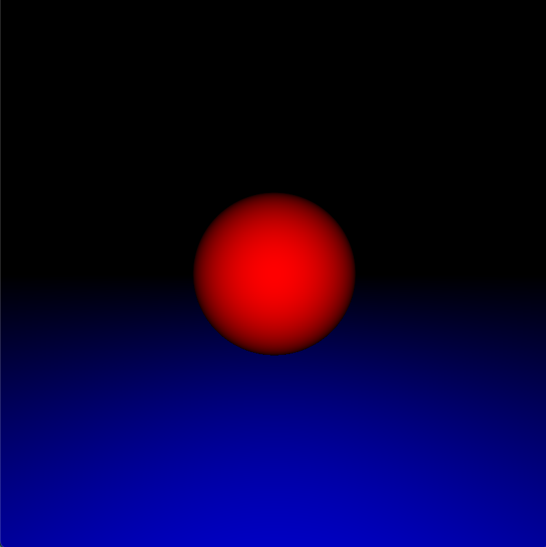
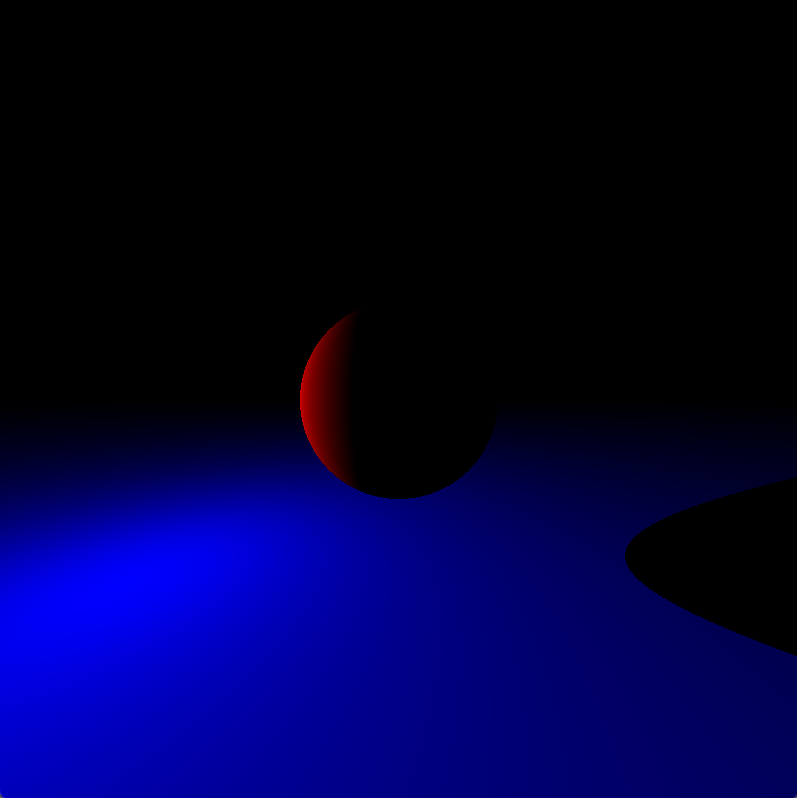
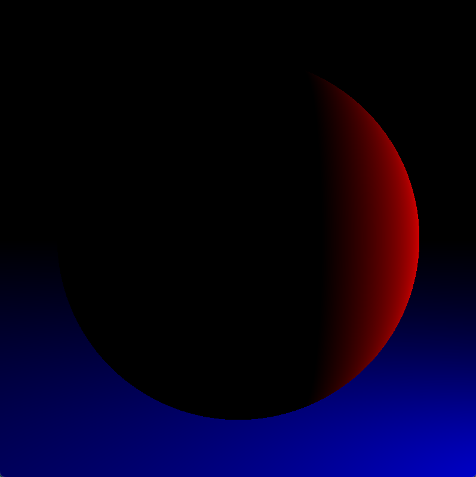
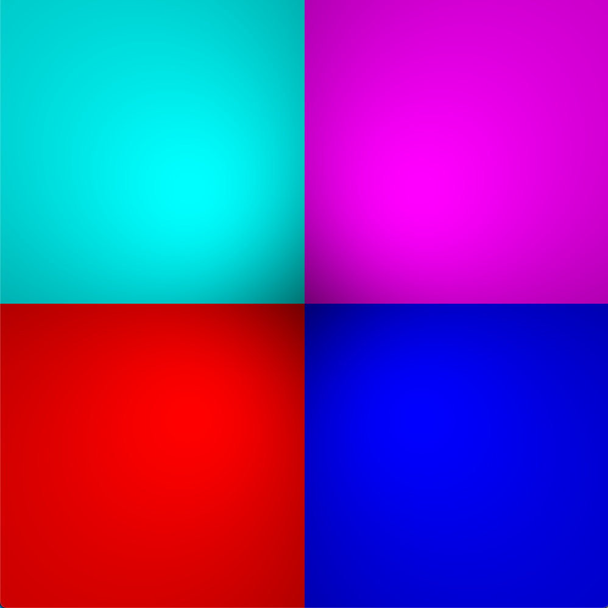
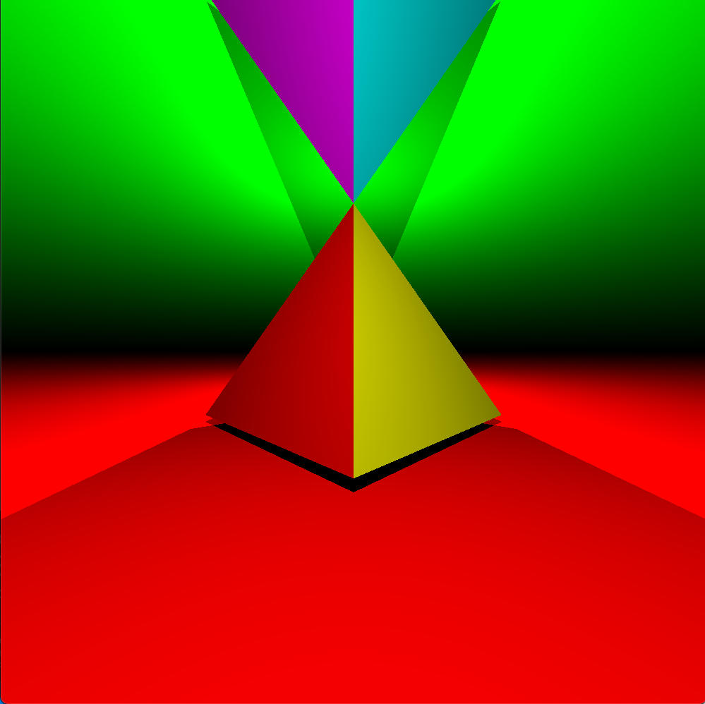
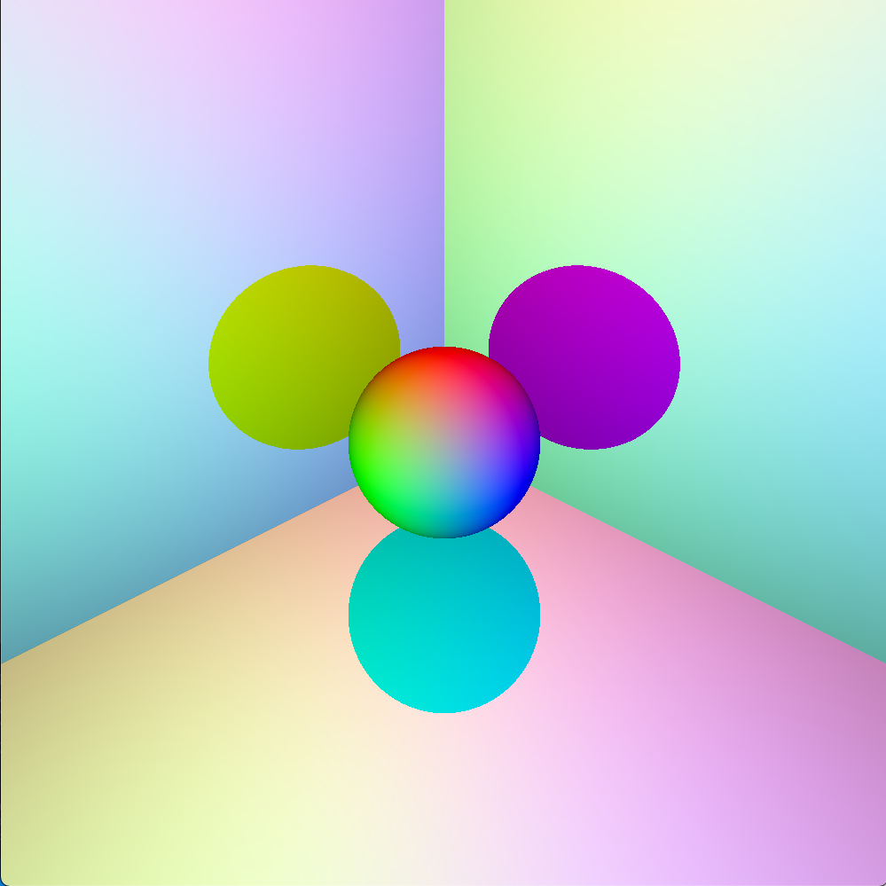
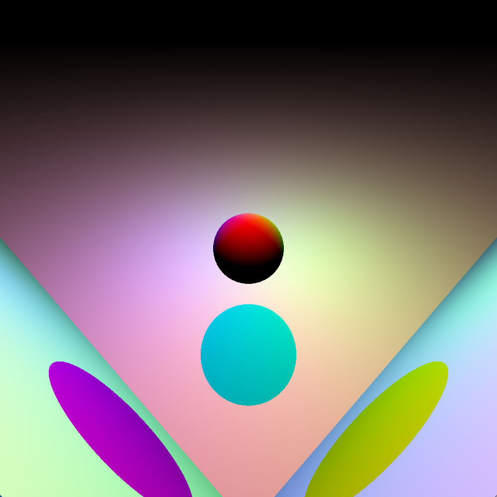
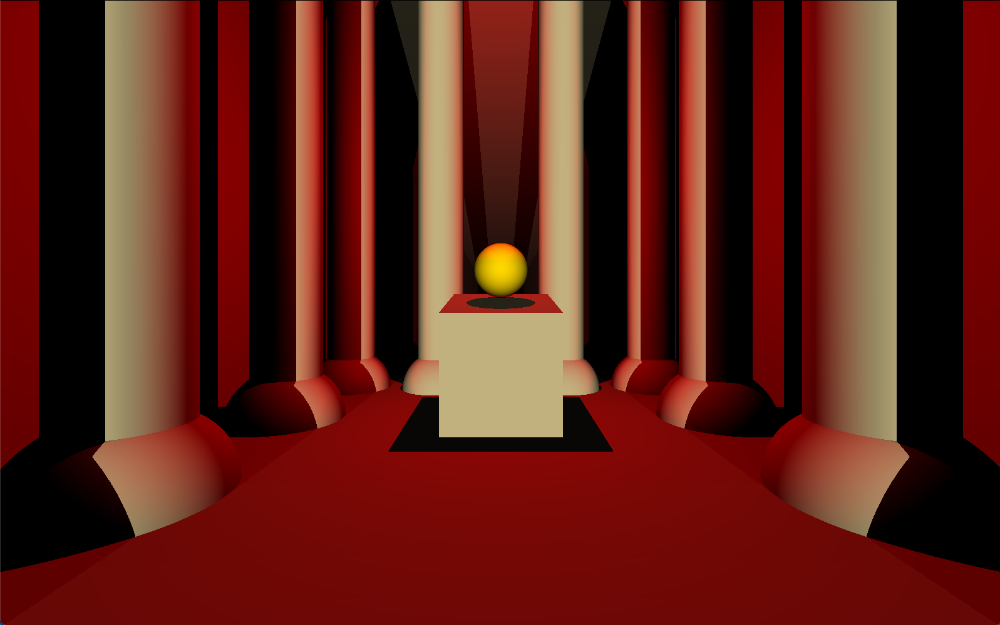

<h1 align="center">
	🎥 miniRT 🎥
</h1>

<p align="center">
	<b><i>CURSUS: 2019/2020 - AUTHOR: fmanetti - GRADE: 100 - FINISHED: 10/10/2020</i></b><br>
</p>

<p align="center">
	This project is an introduction to the beautiful world of Raytracing. Once completed you will be able to render simple Computer-Generated-Images and you will never be afraid of implementing mathematical formulas again.
</p>


## Introduction

The goal of your program is to generate images using the Raytracing protocol. Those computer-generated images will each represent a scene,as seen from a specific angle and position, defined by simple geometric objects, and each with its own lighting system.

For more detailed information, look at the [**subject of this project**](https://github.com/manettifabrizio/42cursus_srcs/tree/main/subjects/miniRT).

### Disclaimer

At 42 school when we program in C we are subject to a set of rules called [**the norm**](https://github.com/manettifabrizio/42cursus_srcs/blob/main/subjects/norm/en.norme_v2.pdf), so if the code is not 100% optimized this is the reason. This project was coded following norminette v2.

## Description


## Examples

<p align="center">
	Red Sphere
</p>
<p align="center" float="left">

 

</p>
	
<p align="center">
	Two Pyramids
</p>
<p align="center" float="left">

 

</p>

<p align="center">
	Sphere RGB
</p>
<p align="center">
	
	 
</p>

<p align="center">
	Indiana Jones Temple
</p>
<p align="center">
	
	 
</p>

## Usage

### Requirements

The function is written in C language and thus needs the **`gcc` compiler** and some standard **C libraries** to run.

### Instructions

To compile, choose the OS and run:

```shell
$ make
```

To launch use the executable `miniRT` and choose a scene from the [`scenes`](macOS/scenes/) directory:

```shell
$ ./miniRT scenes/[C4O3H6/FM/indiana/pyramids/RGB/sphere].rt
```

To customizise a scene go to the `macOS|linux`/scenes directory and modify values.

## Sources

[`Scratchapixel`](https://www.scratchapixel.com/index.php?redirect)
